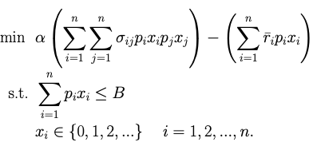
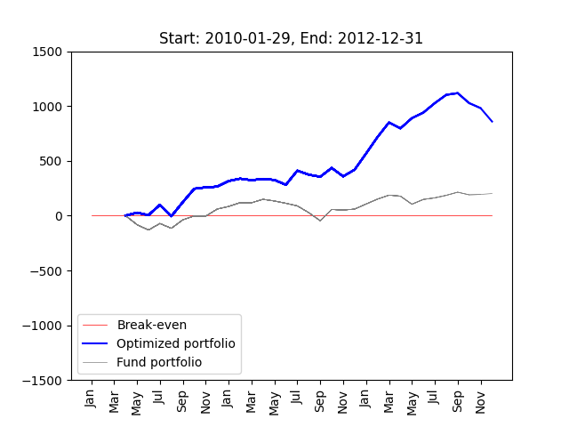

# Portfolio Optimization

Optimizing a portfolio of stocks is a challenging problem that looks to identify the optimal number of shares of each stock to purchase in order to minimize risk (variance) and maximize returns, while staying under some specified spending budget.

## Problem Definition and Mathematical Formulation
Consider a set of n types of stocks to choose from, with an average monthly return per dollar spent of r<sub>i</sub> for each stock i. Furthermore, let &sigma;<sub>i,j</sub> be the covariance of the returns of stocks i and j. For a spending budget of B dollars, let x<sub>i</sub> denote the number of shares of stock i purchased at price p<sub>i</sub> per share. Then, this portfolio optimization problem can be represented as 



Here, &alpha; &gt; 0 is the trade-off coefficient between the risk (variance) and the returns, also known as the risk aversion coefficient. Notice that while we are minimizing the variance, we are also minimizing the negative of the return (which is equivalent to maximizing the return). 


## Running the Demos

There are two main demos included in this repository. For each demo, two models are showcased for the formulation of the portfolio problem:
- Discrete Quadratic Modeling (DQM)
- Constrained Quadratic Modeling (CQM)


### Single-Period Demo

#### CQM Runs 

The single-period demo determines the optimal number of shares to purchase from 3 stocks based on the historical price data provided. To run the demo, type:

```python portfolio.py```

This runs the single-period portfolio optimization problem, as formulated above, using default data stored in `basic_data.csv`, builds the constrained quadratic model (CQM), and runs the CQM on D-Wave's hybrid solver. The output of the run is printed to the console as follows.

```bash
Single period portfolio optimization run...

Max shares we can afford with a budget of 1000
IBM       8
WMT      18
SEHI    555

CQM run...

CQM Formulation: maximize returns - alpha*risk

Number of feasible solutions: 22 out of 46 sampled.

Best energy: -90.05
Best energy (feasible): -41.65

Best feasible solution:
IBM	  2
SEHI	427
WMT	  0

Estimated returns: 62.67
Purchase Cost: 999.78
Variance: 42035.77
```

##### CQM Bounding Formulations 

The demo allows the user to choose among two additional CQM formulations for the portfolio optimization problem: 
- The risk-bounding formulation solves the problem `maximize returns s.t. risk <= max_risk`
- The return-bounding formulation solves the problem `minimize risk s.t. returns >= min_return`

Note that both of these formulations also include the budget constraint. To run the single-period demo with the CQM risk bounding formulation, type:

`python portfolio.py -m 'CQM' --max-risk 10000`

```bash
Single period portfolio optimization run...

Max shares we can afford with a budget of 1000
IBM       8
WMT      18
SEHI    555

CQM run...

CQM Formulation: maximize returns s.t. risk <= max_risk

Number of feasible solutions: 26 out of 44 sampled.

Best energy: -98.13
Best energy (feasible): -33.30

Best feasible solution:
IBM	  3
SEHI	183
WMT	  0

Estimated returns: 33.3
Purchase Cost: 676.17
Variance: 9993.17
```

We can do similarly for the return-bounding formulation: 

`python portfolio.py -m 'CQM' --min-return 50`

```bash
Single period portfolio optimization run...

Max shares we can afford with a budget of 1000
IBM       8
WMT      18
SEHI    555

CQM run...

CQM Formulation: mininimize risk s.t. returns >= min_return

Number of feasible solutions: 26 out of 43 sampled.

Best energy: -0.00
Best energy (feasible):  22940.46

Best feasible solution:
IBM	  4
SEHI	287
WMT	  0

Estimated returns: 50.1
Purchase Cost: 978.96
Variance: 22940.46
```

#### DQM Runs 

The user can select to build a disctrete quadratic model (DQM) using the following command:

```python portfolio.py -m 'DQM'```

This builds a DQM for the single-period portfolio optimization problem and solves it on 
Leap's hybrid solver. The DQM uses a binning approach where the range of the shares of each 
stock is divided into equally-spaced intervals. 

The output of the default DQM run is printed on the console as follows. 

```bash 
Single period portfolio optimization run...

Max shares we can afford with a budget of 1000
IBM       8
WMT      18
SEHI    555

DQM run...

DQM -- solution for alpha == 0.0005 and gamma == 10:

Shares to buy:
IBM	  6
SEHI	166
WMT	  0

Estimated returns: 40.06
Purchase Cost: 992.34
Variance: 15641.24
```

For the DQM single-period problem formulation, this demo gives the user the option to run a 
grid search on the objective parameters, &alpha; and &gamma;. Note that &alpha; is the 
risk-aversion coefficient whereas &gamma; is a penalty coefficient used in DQM to enforced 
the budget inequality. 

The user can opt to run a grid search with DQM by providing a list of candidate values 
for &alpha; (here `[0.5, 0.0005`),and &gamma; (here `[10, 100]`) as follows: 

``python portfolio.py  -m 'DQM' -a 0.5 -a 0.0005 -g 10 -g 100``

The output is printed to the console at each stage in the grid search, as shown below.
```bash
Single period portfolio optimization run...

Max shares we can afford with a budget of 1000
IBM       8
WMT      18
SEHI    555

DQM run...

Starting DQM Grid Search...

Grid search results:

DQM -- solution for alpha == 0.5 and gamma == 10:

Shares to buy:
IBM	  1
SEHI	333
WMT	  5

Estimated returns: 49.42
Purchase Cost: 990.39
Variance: 27437.82


DQM -- solution for alpha == 0.5 and gamma == 100:

Shares to buy:
IBM	  6
SEHI	166
WMT	  0

Estimated returns: 40.06
Purchase Cost: 992.34
Variance: 15641.24


DQM -- solution for alpha == 0.0005 and gamma == 10:

Shares to buy:
IBM	  1
SEHI	333
WMT	  5

Estimated returns: 49.42
Purchase Cost: 990.39
Variance: 27437.82


DQM -- solution for alpha == 0.0005 and gamma == 100:

Shares to buy:
IBM	  6
SEHI	166
WMT	  0

Estimated returns: 40.06
Purchase Cost: 992.34
Variance: 15641.24

DQM Grid Search Completed: alpha=0.0005, gamma=10.-

DQM -- solution for alpha == 0.0005 and gamma == 10:

Shares to buy:
IBM	  1
SEHI	333
WMT	  5

Estimated returns: 49.42
Purchase Cost: 990.39
Variance: 27437.82
```

### Multi-Period Demo

The multi-period demo provides an analysis of portfolio value over time: rebalancing the 
portfolio at each time period until the target time. To run the demo with default data and 
settings, type:

`python portfolio.py -r`

The program will pull historical data on four stocks from Yahoo! finance over a period of 3 
years. For each month in the year, the optimal portfolio is computed and the funds are 
reinvested. A plot shows the trend of the portfolio value over time, as compared to a fund 
portfolio (investing all of the budget into a given fund, such as S&P500).

Note that this demo will take longer to run and will make many calls to the hybrid solvers, 
as it is running the model for each month over a 3-year period, resulting in optimizing 
over 30 different portfolios.

At the end of the analysis, the plot is saved as a .png file, as shown below.



## Problem Set Up

### Variance

The variance is the product of amount spent within each of two stocks multiplied by 
thecovariance of the two stocks, summed over all pairs of stocks (with repetition).

`sum(stocks i and j) cov(i,j)*purchase(i)*purchase(j)`

### Returns

To compute the returns for a given purchase profile, we add up the expected returns for each 
stock: amount spent on the stock times the average monthly return of the stock.

`sum(stock i) return(i)*purchase(i)`

### Budget

We cannot spend more than the budget allocated. This is a simple `<=` constraint (natively 
enforced in CQM). This requirement can also be modeled as a double inequality with a lower 
bound on spending (as we do in the case of DQM):  `minimum expenses <= expenses <= budget`.
Here, the quantity `minimum expenses` can be selected to be a relatively close fraction of 
the budget (e.g., 90% of the budget). This encoding of the budget requirement has practical 
implications in that it allows the investor to specify a minimum amount to spend. In 
addition, specifying a lower bound on the expenses will aid with the model formulation: the 
higher the bound, the fewer slack variables needed for the DQM formulation. 

## Code 

### Options 

The `portfolio.py` program can be called with these additional options:
- -b, --budget: problem budget 
- -d, --dates: list of [start_date, end_date] for multi-period portfolio optimization problem 
- -f, --file-path: full path of file with csv stock data 
- -n, --bin-size: bin size for dqm binning 
- -s, --stocks: list of stocks for the problem 
- -v, --verbose: to turn on or off additional code output 
- -z, --baseline: baseline stock for multi-period portfolio optimization run 


### DQM

#### Variables and Cases

The constant `bin_size` determines the number of different purchase quantity options every 
stock will have. All variables will have a maximum number of cases less than or equal to 
`bin_size`, and they are evenly spaced out in the interval from 0 to the maximum number of 
shares possible to purchase given the price and budget.

#### Grid Search

For DQM, the budgeting constraint is added as a component of the objective function 
expression with an associated penalty coefficient &gamma;. The DQM code contains the option 
to do a grid search in order to obtain the best values of the penalty coefficients &gamma; 
and the risk-aversion coefficient &alpha; that result in the best objective value. 

### CQM 

### Variables
Each x<sub>i</sub> denotes the number of shares of stock i to be purchased. 

### Constraints 

All CQM formulations include the budget constraint described earlier. 

##### Risk-Bounding Formulation 

This includes an upper bound on the risk as a quadratic constraint.  
Such a constraint is supported natively by CQM. 

##### Return-Bounding Formulation
This includes a lower bound on the returns as a linear inequality constraint.  


## References

Ahmed, Shabbir. "The Optimization Process: An example of portfolio optimization." 
Georgia Tech University (2002). https://www2.isye.gatech.edu/~sahmed/isye6669/notes/portfolio.pdf
